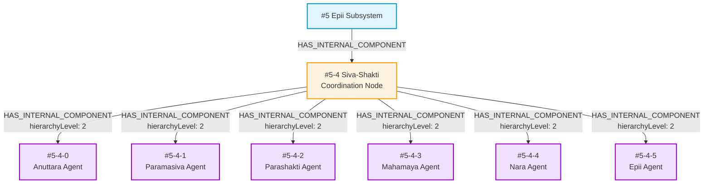
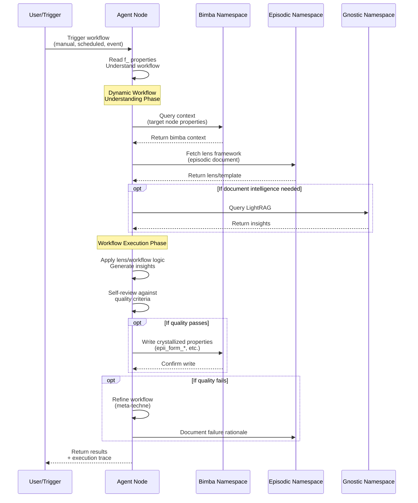
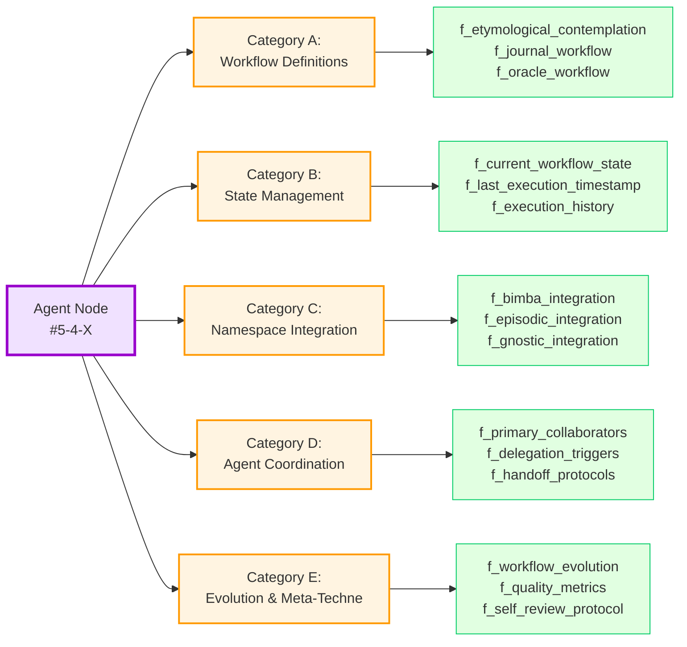

# Agent Node Functional Property Migration Plan

**Created**: 2025-10-05
**Status**: Planning Phase
**Sprint**: Sprint 3
**Related**: Functional Properties Protocol, Etymology Workflow Implementation

---

## Executive Summary

This plan outlines the strategy for:
1. Creating agent nodes in the Bimba graph (#5-4-0 through #5-4-5)
2. Migrating functional properties from conceptual to implemented state
3. Specifically implementing epii's etymological workflow f_ properties
4. Establishing generalizable patterns for future agent node workflows

The approach emphasizes **separation of concerns**: agent nodes hold functional (`f_*`) properties defining workflows, while subsystem nodes hold epistemic/ontological properties representing domain knowledge.

---

## Part I: Agent Node Architecture

### 1.1 The Six Agent Nodes

Agent nodes represent the **agentic manifestation** of each subsystem coordinate within the multi-agent constellation:

```yaml
#5-4-0: Anuttara Agent (Proto-logical Processing)
  - Grounding validation workflows
  - Neo4j core operations
  - Foundational coherence checking

#5-4-1: Paramasiva Agent (Quaternal Logic Engine)
  - QL-based reasoning workflows
  - Logical coherence validation
  - Symbolic pattern processing

#5-4-2: Parashakti Agent (Vibrational Processing)
  - Harmonic analysis workflows
  - MEF lens-based analysis (6 lenses)
  - Pattern recognition and resonance detection

#5-4-3: Mahamaya Agent (Symbolic Transcription)
  - Narrative synthesis workflows
  - Symbol transformation protocols
  - Episodic-to-Bimba crystallization

#5-4-4: Nara Agent (Dialogical Interface)
  - User interaction workflows
  - Journal and oracle protocols
  - Personal resonance tuning

#5-4-5: Epii Agent (Orchestration Synthesis)
  - Master coordination workflows
  - Etymological contemplation (Form Cycle, Logos Cycle)
  - Meta-cognitive synthesis
```

### 1.2 Graph Topology

```
#5 (epii subsystem)
  ├─ HAS_INTERNAL_COMPONENT → #5-4 (Siva-Shakti coordination node)
      ├─ HAS_INTERNAL_COMPONENT → #5-4-0 (Anuttara Agent)
      ├─ HAS_INTERNAL_COMPONENT → #5-4-1 (Paramasiva Agent)
      ├─ HAS_INTERNAL_COMPONENT → #5-4-2 (Parashakti Agent)
      ├─ HAS_INTERNAL_COMPONENT → #5-4-3 (Mahamaya Agent)
      ├─ HAS_INTERNAL_COMPONENT → #5-4-4 (Nara Agent)
      └─ HAS_INTERNAL_COMPONENT → #5-4-5 (Epii Agent)
```

**Relationship Properties:**
- `hierarchyLevel: 2` (two levels deep from #5)
- `relationshipType: "agent_manifestation"`
- `functionalRole: "workflow_execution"`

### 1.3 Core Agent Node Properties

Every agent node includes:

```yaml
# Identity
bimbaCoordinate: "#5-4-X"
name: "[Subsystem Name] Agent"
subsystem: X
primaryDesignation: "Agentic manifestation of #X subsystem"

# Operational Context
agentRole: "workflow_executor | coordinator | specialist"
primaryNamespace: "bimba | episodic | gnostic"
supportingNamespaces: [...]

# Coordination
coordinatesWithAgents: ["#5-4-Y", "#5-4-Z"]
reportingProtocol: "autonomous | coordinated | supervised"
```

---

## Part II: Functional Property Migration Strategy

### 2.1 Property Namespace Design

**Functional properties use `f_` prefix** to distinguish from conceptual properties:

```yaml
# Conceptual (lives on subsystem nodes #0-#5)
name: "Vibrational Processing"
coreNature: "Dynamic in-formation through resonant patterns"
concrescencePhase: "Physical Prehension / Ingression"

# Functional (lives on agent nodes #5-4-X)
f_mef_lens_analysis: {...}
f_harmonic_detection_threshold: 0.7
f_resonance_update_trigger: "post_analysis"
```

### 2.2 Functional Property Categories

#### Category A: Workflow Definitions
Properties that define agent capabilities and execution patterns:

```yaml
f_[workflow_name]:
  description: "Human-readable workflow description"
  workflow_type: "contemplative | analytical | transformational | dialogical"
  trigger_conditions: ["manual", "scheduled", "event_driven"]
  workflow_steps: [...]
  quality_criteria: [...]
  output_format: {...}
```

#### Category B: State Management
Properties tracking workflow execution state:

```yaml
f_current_workflow_state: "idle | executing | completed | failed"
f_last_execution_timestamp: "ISO-8601"
f_execution_history_max: 100
f_state_transition_rules: [...]
```

#### Category C: Namespace Integration
Properties defining interaction with three namespaces:

```yaml
f_bimba_integration:
  query_patterns: [...]
  write_permissions: "read_only | read_write"
  coordinate_scope: ["#X", "#X-Y-*"]

f_episodic_integration:
  document_types: ["reflection", "analysis", "synthesis"]
  storage_protocol: "graphiti_temporal"

f_gnostic_integration:
  lightrag_graph_access: true
  document_intelligence_scope: [...]
```

#### Category D: Agent Coordination
Properties enabling multi-agent collaboration:

```yaml
f_primary_collaborators: ["#5-4-Y", "#5-4-Z"]
f_delegation_triggers: [...]
f_handoff_protocols: {...}
f_collaboration_patterns: [...]
```

#### Category E: Evolution & Meta-Techne
Properties enabling workflow self-improvement:

```yaml
f_quality_metrics: [...]
f_evolution_trigger_conditions: [...]
f_workflow_version: "1.0.0"
f_self_review_protocol: {...}
```

### 2.3 Etymology Workflow F_ Properties (Epii Agent #5-4-5)

Based on the concrescence crystallization document, here are the specific f_ properties for epii's etymological contemplation:

```yaml
# Node: #5-4-5 (Epii Agent)

f_etymological_contemplation:
  description: "Workflow for applying etymological lenses to generate insights on subsystem nodes"
  workflow_type: "contemplative"

  lenses_available:
    - name: "form_cycle"
      source: "episodic://form-cycle-etymology"
      episodic_reference: "/memory/sprint_tracking/sprint-3/sprint-3-fruits/epii-etymological-workflow-planning/form-etymology-concrescence-crystallisation.md"
      output_prefix: "epii_form_"
      applicable_to: ["subsystems", "any_node"]
      phases: ["Pro-Forma", "Format", "In-formation", "Formalisation", "Performance", "Re-form"]

    - name: "logos_cycle"
      source: "episodic://logos-cycle-etymology"
      output_prefix: "epii_logos_"
      applicable_to: ["#5_children", "synthesis_contexts"]
      phases: ["TBD - to be documented"]

  workflow_steps:
    - step: "access_episodic_lens_document"
      description: "Retrieve lens framework from episodic namespace"
      namespace: "episodic"

    - step: "identify_target_node_context"
      description: "Understand target node's current properties and relationships"
      namespace: "bimba"

    - step: "apply_lens_mapping"
      description: "Map lens framework to target node characteristics"
      method: "concrescence_phase_alignment"

    - step: "generate_insight_properties"
      description: "Create epii_[lens]_* properties based on lens illumination"
      validation: "mef_lens_reflection"

    - step: "validate_non_redundancy"
      description: "Ensure insights don't duplicate existing properties"

    - step: "commit_to_target_node"
      description: "Write generated properties to target subsystem node"
      namespace: "bimba"
      authorization_required: true

  quality_criteria:
    - "lens_clear_illumination"
    - "non_redundant_with_existing"
    - "traceable_to_episodic_source"
    - "processual_coherence"
    - "mef_lens_grounded"

  output_format:
    property_prefix: "epii_"
    lens_identifier: "{lens_name}_"
    insight_key: "{specific_aspect}"
    # Results in: epii_form_designation, epii_form_essence, epii_logos_synthesis, etc.

  trigger_conditions:
    - "manual_contemplation_request"
    - "new_subsystem_node_created"
    - "episodic_lens_document_finalized"
    - "scheduled_quarterly_review"

f_crystallization_workflow:
  description: "Episodic-to-Bimba distillation protocol for transforming episodic richness into bimba properties"
  workflow_type: "transformational"

  process_phases:
    - phase: "episodic_exploration"
      description: "Unconstrained investigation in episodic namespace"
      constraints: "none"

    - phase: "mef_lens_reflection"
      description: "Apply MEF 6 lenses to episodic material"
      lenses: ["archetypal", "causal", "logical", "processual", "meta_epistemic", "divine_scalar"]

    - phase: "crystallization_selection"
      description: "Identify which insights crystallize into bimba"
      criteria: "multi_lens_illumination"

    - phase: "property_generation"
      description: "Create minimal sufficient bimba properties"
      principle: "clarity + precision + non_redundancy"

    - phase: "integration"
      description: "Link episodic source to bimba crystallizations"
      maintain: "bidirectional_references"

  quality_gates:
    - "lens_grounded"
    - "minimal_sufficient"
    - "computationally_queryable"
    - "source_linked"
    - "evolution_open"

  mef_lens_criteria:
    lens0_archetypal: "Does this reveal mathematical/archetypal foundations?"
    lens1_causal: "Does this clarify causal relationships?"
    lens2_logical: "Does this navigate paradox or resolve contradiction?"
    lens3_processual: "Does this reveal ontological becoming?"
    lens4_meta_epistemic: "Does this illuminate knowing itself?"
    lens5_divine_scalar: "Does this connect to ultimate source/return?"

  output_tracking:
    crystallized_properties: []
    episodic_source_documents: []
    crystallization_rationale: "stored_per_property"

f_logos_cycle_orchestration:
  description: "Workflow for orchestrating the Logos Cycle through etymological contemplation"
  workflow_type: "contemplative"
  status: "to_be_implemented"
  episodic_planning_reference: "/memory/sprint_tracking/sprint-3/sprint-3-fruits/epii-etymological-workflow-planning/etymological-workflow-outline.md"

  # Properties to be defined based on Logos Cycle document creation

f_workflow_evolution:
  description: "Meta-techne protocol for workflow self-improvement"

  self_review_triggers:
    - "post_workflow_execution"
    - "quality_metric_below_threshold"
    - "user_feedback_received"

  evolution_protocol:
    - "capture_execution_trace"
    - "analyze_bottlenecks_failures"
    - "identify_improvement_opportunities"
    - "propose_workflow_refinements"
    - "validate_refinements_sandbox"
    - "update_workflow_properties"

  version_control:
    current_version: "1.0.0"
    versioning_scheme: "semantic"
    rollback_capability: true

f_namespace_integration:
  bimba:
    query_patterns:
      - "subsystem_node_retrieval"
      - "relationship_traversal"
      - "property_reading"
    write_patterns:
      - "epii_property_addition"
      - "crystallization_property_creation"
    coordinate_scope: ["#0", "#1", "#2", "#3", "#4", "#5", "#5-*"]

  episodic:
    document_types:
      - "etymological_lens_frameworks"
      - "contemplation_records"
      - "crystallization_justifications"
    storage_protocol: "graphiti_temporal_graph"
    access_pattern: "read_primary_write_secondary"

  gnostic:
    usage: "minimal"
    reason: "Etymological work primarily uses episodic (temporal context) and bimba (structural knowledge)"

f_agent_coordination:
  primary_collaborators:
    - agent: "#5-4-2"
      name: "Parashakti Agent"
      collaboration_context: "MEF lens analysis expertise"

    - agent: "#5-4-3"
      name: "Mahamaya Agent"
      collaboration_context: "Symbolic transcription and narrative synthesis"

  delegation_patterns:
    - trigger: "requires_mef_lens_analysis"
      delegate_to: "#5-4-2"
      handoff_protocol: "provide_target_node_episodic_context"

    - trigger: "requires_narrative_synthesis"
      delegate_to: "#5-4-3"
      handoff_protocol: "provide_crystallization_candidates"

  reporting_protocol: "autonomous_with_user_approval_gates"
```

### 2.4 Nara Agent F_ Properties (For Later Implementation)

```yaml
# Node: #5-4-4 (Nara Agent)

f_journal_workflow:
  description: "Personal journaling and reflection workflow"
  workflow_type: "dialogical"
  # To be implemented in future sprint

f_oracle_workflow:
  description: "Divination and guidance workflow"
  workflow_type: "contemplative"
  # To be implemented in future sprint

f_personal_resonance_tuning:
  description: "Learning user's symbolic resonances over time"
  workflow_type: "analytical"
  # To be implemented in future sprint
```

---

## Part III: Cypher Migration Scripts

### 3.1 General Agent Node Creation Template

```cypher
// ============================================
// AGENT NODE CREATION TEMPLATE
// ============================================
// Purpose: Create agent node with basic structure
// Usage: Customize for each specific agent
// ============================================

// Step 1: Create the agent node
CREATE (agent:BimbaNode {
    bimbaCoordinate: $agentCoordinate,  // e.g., "#5-4-5"
    name: $agentName,                    // e.g., "Epii Agent"
    subsystem: $subsystemNumber,         // e.g., 5
    primaryDesignation: $designation,    // e.g., "Agentic manifestation of Epii subsystem"

    // Agent-specific properties
    agentRole: $role,                    // "workflow_executor" | "coordinator" | "specialist"
    primaryNamespace: $namespace,        // "bimba" | "episodic" | "gnostic"

    // Metadata
    createdAt: datetime(),
    createdBy: "migration_script",
})

// Step 2: Link to coordination node
WITH agent
MATCH (coord:BimbaNode {bimbaCoordinate: "#5-4"})
CREATE (coord)-[r:HAS_INTERNAL_COMPONENT {
    hierarchyLevel: 2,
    relationshipType: "agent_manifestation",
    functionalRole: "workflow_execution",
    createdAt: datetime()
}]->(agent)

RETURN agent.bimbaCoordinate AS created_agent,
       agent.name AS agent_name
```

### 3.2 Functional Property Addition Template

```cypher
// ============================================
// FUNCTIONAL PROPERTY ADDITION TEMPLATE
// ============================================
// Purpose: Add f_ properties to existing agent node
// Usage: Customize property map for specific workflow
// ============================================

MATCH (agent:BimbaNode {bimbaCoordinate: $agentCoordinate})

// Add functional properties using SET
SET agent += $functionalProperties

// Add metadata about property update
SET agent.lastPropertyUpdate = datetime(),
    agent.propertyVersion = COALESCE(agent.propertyVersion, 0) + 1

RETURN agent.bimbaCoordinate AS updated_agent,
       keys(agent) AS all_properties,
       [key IN keys(agent) WHERE key STARTS WITH 'f_'] AS functional_properties
```

### 3.3 Specific Script: Create All Six Agent Nodes

```cypher
// ============================================
// CREATE ALL SIX AGENT NODES
// ============================================
// Purpose: Initialize complete agent constellation
// Status: Ready to execute
// ============================================

// Verify #5-4 coordination node exists
MATCH (coord:BimbaNode {bimbaCoordinate: "#5-4"})

// Create #5-4-0: Anuttara Agent
CREATE (a0:BimbaNode {
    bimbaCoordinate: "#5-4-0",
    name: "Anuttara Agent",
    subsystem: 0,
    primaryDesignation: "Agentic manifestation of Anuttara subsystem - proto-logical grounding and Neo4j core operations",
    createdAt: datetime(),
})
CREATE (coord)-[:HAS_INTERNAL_COMPONENT {
    hierarchyLevel: 2,
    relationshipType: "agent_manifestation",
    functionalRole: "workflow_execution"
}]->(a0)

// Create #5-4-1: Paramasiva Agent
CREATE (a1:BimbaNode {
    bimbaCoordinate: "#5-4-1",
    name: "Paramasiva Agent",
    subsystem: 1,
    primaryDesignation: "Agentic manifestation of Paramasiva subsystem - quaternal logic reasoning and symbolic processing",
    createdAt: datetime(),
})
CREATE (coord)-[:HAS_INTERNAL_COMPONENT {
    hierarchyLevel: 2,
    relationshipType: "agent_manifestation",
    functionalRole: "workflow_execution"
}]->(a1)

// Create #5-4-2: Parashakti Agent
CREATE (a2:BimbaNode {
    bimbaCoordinate: "#5-4-2",
    name: "Parashakti Agent",
    subsystem: 2,
    primaryDesignation: "Agentic manifestation of Parashakti subsystem - vibrational processing and MEF lens analysis",
    createdAt: datetime(),
})
CREATE (coord)-[:HAS_INTERNAL_COMPONENT {
    hierarchyLevel: 2,
    relationshipType: "agent_manifestation",
    functionalRole: "workflow_execution"
}]->(a2)

// Create #5-4-3: Mahamaya Agent
CREATE (a3:BimbaNode {
    bimbaCoordinate: "#5-4-3",
    name: "Mahamaya Agent",
    subsystem: 3,
    primaryDesignation: "Agentic manifestation of Mahamaya subsystem - symbolic transcription and narrative synthesis",
    createdAt: datetime(),
})
CREATE (coord)-[:HAS_INTERNAL_COMPONENT {
    hierarchyLevel: 2,
    relationshipType: "agent_manifestation",
    functionalRole: "workflow_execution"
}]->(a3)

// Create #5-4-4: Nara Agent
CREATE (a4:BimbaNode {
    bimbaCoordinate: "#5-4-4",
    name: "Nara Agent",
    subsystem: 4,
    primaryDesignation: "Agentic manifestation of Nara subsystem - dialogical interface and personal context",
    createdAt: datetime(),
})
CREATE (coord)-[:HAS_INTERNAL_COMPONENT {
    hierarchyLevel: 2,
    relationshipType: "agent_manifestation",
    functionalRole: "workflow_execution"
}]->(a4)

// Create #5-4-5: Epii Agent
CREATE (a5:BimbaNode {
    bimbaCoordinate: "#5-4-5",
    name: "Epii Agent",
    subsystem: 5,
    primaryDesignation: "Agentic manifestation of Epii subsystem - master coordination and etymological contemplation",
    createdAt: datetime(),
})
CREATE (coord)-[:HAS_INTERNAL_COMPONENT {
    hierarchyLevel: 2,
    relationshipType: "agent_manifestation",
    functionalRole: "workflow_execution"
}]->(a5)

RETURN
    a0.bimbaCoordinate AS anuttara_agent,
    a1.bimbaCoordinate AS paramasiva_agent,
    a2.bimbaCoordinate AS parashakti_agent,
    a3.bimbaCoordinate AS mahamaya_agent,
    a4.bimbaCoordinate AS nara_agent,
    a5.bimbaCoordinate AS epii_agent
```

### 3.4 Specific Script: Add Etymology Workflow to Epii Agent

```cypher
// ============================================
// ADD ETYMOLOGY WORKFLOW F_ PROPERTIES TO EPII AGENT
// ============================================
// Purpose: Implement f_etymological_contemplation and f_crystallization_workflow
// Target: #5-4-5 (Epii Agent)
// Based on: form-etymology-concrescence-crystallisation.md
// ============================================

MATCH (epii:BimbaNode {bimbaCoordinate: "#5-4-5"})

SET epii.f_etymological_contemplation = {
    description: "Workflow for applying etymological lenses to generate insights on subsystem nodes",
    workflow_type: "contemplative",
    status: "implemented",
    version: "1.0.0"
}

SET epii.f_etymological_contemplation_lenses = [
    {
        name: "form_cycle",
        source: "episodic://form-cycle-etymology",
        episodic_reference: "/memory/sprint_tracking/sprint-3/sprint-3-fruits/epii-etymological-workflow-planning/form-etymology-concrescence-crystallisation.md",
        output_prefix: "epii_form_",
        applicable_to: ["subsystems", "any_node"],
        phases: ["Pro-Forma", "Format", "In-formation", "Formalisation", "Performance", "Re-form"]
    },
    {
        name: "logos_cycle",
        source: "episodic://logos-cycle-etymology",
        output_prefix: "epii_logos_",
        applicable_to: ["#5_children", "synthesis_contexts"],
        status: "planned"
    }
]

SET epii.f_etymological_contemplation_steps = [
    "access_episodic_lens_document",
    "identify_target_node_context",
    "apply_lens_mapping",
    "generate_insight_properties",
    "validate_non_redundancy",
    "commit_to_target_node"
]

SET epii.f_etymological_contemplation_quality_criteria = [
    "lens_clear_illumination",
    "non_redundant_with_existing",
    "traceable_to_episodic_source",
    "processual_coherence",
    "mef_lens_grounded"
]

SET epii.f_etymological_contemplation_triggers = [
    "manual_contemplation_request",
    "new_subsystem_node_created",
    "episodic_lens_document_finalized",
    "scheduled_quarterly_review"
]

SET epii.f_crystallization_workflow = {
    description: "Episodic-to-Bimba distillation protocol",
    workflow_type: "transformational",
    status: "implemented",
    version: "1.0.0"
}

SET epii.f_crystallization_workflow_phases = [
    "episodic_exploration",
    "mef_lens_reflection",
    "crystallization_selection",
    "property_generation",
    "integration"
]

SET epii.f_crystallization_mef_lens_criteria = {
    lens0_archetypal: "Does this reveal mathematical/archetypal foundations?",
    lens1_causal: "Does this clarify causal relationships?",
    lens2_logical: "Does this navigate paradox or resolve contradiction?",
    lens3_processual: "Does this reveal ontological becoming?",
    lens4_meta_epistemic: "Does this illuminate knowing itself?",
    lens5_divine_scalar: "Does this connect to ultimate source/return?"
}

SET epii.f_crystallization_quality_gates = [
    "lens_grounded",
    "minimal_sufficient",
    "computationally_queryable",
    "source_linked",
    "evolution_open"
]

SET epii.f_logos_cycle_orchestration = {
    description: "Workflow for orchestrating the Logos Cycle",
    workflow_type: "contemplative",
    status: "to_be_implemented",
    episodic_planning_reference: "/memory/sprint_tracking/sprint-3/sprint-3-fruits/epii-etymological-workflow-planning/etymological-workflow-outline.md"
}

SET epii.f_workflow_evolution = {
    description: "Meta-techne protocol for workflow self-improvement",
    current_version: "1.0.0",
    versioning_scheme: "semantic",
    rollback_capability: true
}

SET epii.f_workflow_evolution_triggers = [
    "post_workflow_execution",
    "quality_metric_below_threshold",
    "user_feedback_received"
]

SET epii.f_namespace_integration_bimba = {
    query_patterns: ["subsystem_node_retrieval", "relationship_traversal", "property_reading"],
    write_patterns: ["epii_property_addition", "crystallization_property_creation"],
    coordinate_scope: ["#0", "#1", "#2", "#3", "#4", "#5", "#5-*"]
}

SET epii.f_namespace_integration_episodic = {
    document_types: ["etymological_lens_frameworks", "contemplation_records", "crystallization_justifications"],
    storage_protocol: "graphiti_temporal_graph",
    access_pattern: "read_primary_write_secondary"
}

SET epii.f_namespace_integration_gnostic = {
    usage: "minimal",
    reason: "Etymological work primarily uses episodic and bimba"
}

SET epii.lastPropertyUpdate = datetime(),
    epii.propertyVersion = 1

RETURN
    epii.bimbaCoordinate AS agent,
    epii.name AS agent_name,
    [key IN keys(epii) WHERE key STARTS WITH 'f_'] AS functional_properties_added
```

### 3.5 Verification Script

```cypher
// ============================================
// VERIFY AGENT NODE CREATION AND F_ PROPERTIES
// ============================================

// Check all agent nodes exist
MATCH (coord:BimbaNode {bimbaCoordinate: "#5-4"})-[:HAS_INTERNAL_COMPONENT]->(agent:BimbaNode)
WHERE agent.bimbaCoordinate STARTS WITH "#5-4-"
RETURN
    agent.bimbaCoordinate AS coordinate,
    agent.name AS name,
    agent.agentRole AS role,
    agent.primaryNamespace AS namespace,
    [key IN keys(agent) WHERE key STARTS WITH 'f_'] AS functional_properties
ORDER BY agent.bimbaCoordinate

// Check Epii agent etymology workflow properties specifically
UNION

MATCH (epii:BimbaNode {bimbaCoordinate: "#5-4-5"})
RETURN
    epii.bimbaCoordinate AS coordinate,
    epii.f_etymological_contemplation.status AS etymology_workflow_status,
    size(epii.f_etymological_contemplation_lenses) AS lens_count,
    size(epii.f_etymological_contemplation_steps) AS step_count,
    epii.f_crystallization_workflow.status AS crystallization_status
```

---

## Part IV: Documentation Updates

### 4.1 Update functional-property-architecture-methodology.md

**Additions needed:**

1. **Section: Agent Node Functional Properties**
   - Explain agent nodes as f_ property containers
   - Distinguish from subsystem nodes (epistemic/ontological)
   - Provide examples from #5-4-X nodes

2. **Section: Workflow Property Structure**
   - Define workflow property template
   - Explain the 5 categories (workflow, state, namespace, coordination, evolution)
   - Provide epii etymology workflow as exemplar

3. **Section: Migration Methodology**
   - Document the Cypher-based migration approach
   - Explain general → specific script pattern
   - Include verification protocols

4. **Section: Agent-Workflow Interaction Pattern**
   - Abstract query/interaction pattern
   - Workflow trigger → dynamic understanding → cache → execution → refinement
   - Self-evolving capability through meta-techne

### 4.2 Create New Documentation File: agent-workflow-patterns.md

**Structure:**
```markdown
# Agent Workflow Patterns

## Abstract Interaction Pattern
[Diagram + explanation of universal agent workflow cycle]

## Workflow Types
- Contemplative (etymology, oracle)
- Analytical (MEF lens analysis, resonance detection)
- Transformational (crystallization, synthesis)
- Dialogical (journal, user interaction)

## Trigger Mechanisms
- Manual user request
- Scheduled execution
- Event-driven (new node created, document finalized)
- Threshold-based (quality metric falls below target)

## Dynamic Workflow Understanding
[How agents parse their own f_ properties to understand what to do]

## Caching and Optimization
[Workflow execution caching strategies]

## Self-Review and Evolution
[Meta-techne: how workflows improve themselves]

## Examples
- Etymology contemplation workflow (epii agent)
- MEF lens analysis workflow (parashakti agent)
- Journal workflow (nara agent)
```

---

## Part V: Mermaid Diagrams

### 5.1 Agent Node Graph Topology



### 5.2 Agent Workflow Execution Pattern



### 5.3 Etymology Workflow Specific Flow

```mermaid
flowchart TD
    Start([Trigger: Etymology<br/>Contemplation Request])

    Start --> ReadProps[Read f_etymological_contemplation<br/>from #5-4-5]
    ReadProps --> SelectLens{Select Lens:<br/>Form or Logos Cycle?}

    SelectLens -->|Form Cycle| FetchForm[Fetch episodic document:<br/>form-etymology-concrescence<br/>-crystallisation.md]
    SelectLens -->|Logos Cycle| FetchLogos[Fetch episodic document:<br/>logos-cycle<br/>(to be created)]

    FetchForm --> GetTarget[Get target node<br/>from Bimba<br/>(e.g., #2 Parashakti)]
    FetchLogos --> GetTarget

    GetTarget --> ApplyLens[Apply lens mapping:<br/>Align phases to<br/>node characteristics]

    ApplyLens --> GenerateInsights[Generate insight properties:<br/>epii_form_designation,<br/>epii_form_essence, etc.]

    GenerateInsights --> Validate{Validate against<br/>quality criteria}

    Validate -->|Pass| CheckRedundancy{Non-redundant<br/>with existing<br/>properties?}
    Validate -->|Fail| RefineWorkflow[Refine workflow<br/>meta-techne evolution]

    CheckRedundancy -->|Yes| CommitProps[Commit properties<br/>to target node]
    CheckRedundancy -->|No| SkipWrite[Skip write,<br/>document rationale]

    CommitProps --> UpdateMetadata[Update execution metadata:<br/>timestamp, version, trace]
    SkipWrite --> UpdateMetadata
    RefineWorkflow --> UpdateMetadata

    UpdateMetadata --> End([Return results])

    classDef trigger fill:#e1f5ff,stroke:#0099cc
    classDef process fill:#f0e1ff,stroke:#9900cc
    classDef decision fill:#fff4e1,stroke:#ff9900
    classDef data fill:#e1ffe1,stroke:#00cc66

    class Start,End trigger
    class ReadProps,FetchForm,FetchLogos,GetTarget,ApplyLens,GenerateInsights,CommitProps,UpdateMetadata,SkipWrite,RefineWorkflow process
    class SelectLens,Validate,CheckRedundancy decision
```

### 5.4 Functional Property Categories



---

## Part VI: Implementation Roadmap

### Phase 1: Foundation (Current Sprint)

**Tasks:**
1. ✅ Create planning document (this document)
2. ⬜ Review and validate approach with user
3. ⬜ Execute Cypher script 3.3: Create all six agent nodes
4. ⬜ Execute Cypher script 3.4: Add etymology workflow f_ properties to epii agent
5. ⬜ Execute verification script 3.5
6. ⬜ Update functional-property-architecture-methodology.md
7. ⬜ Create agent-workflow-patterns.md

### Phase 2: Etymology Workflow Implementation (Next Sprint)

**Tasks:**
1. ⬜ Implement Python agent code to read f_etymological_contemplation properties
2. ⬜ Create etymology workflow executor (parse steps, execute logic)
3. ⬜ Test Form Cycle lens application on subsystem nodes
4. ⬜ Document Logos Cycle in episodic namespace
5. ⬜ Add Logos Cycle lens to f_etymological_contemplation_lenses
6. ⬜ Validate crystallization quality gates

### Phase 3: Additional Agent Workflows (Future Sprints)

**Tasks:**
1. ⬜ Implement Nara journal workflow f_ properties
2. ⬜ Implement Nara oracle workflow f_ properties
3. ⬜ Implement Parashakti MEF lens analysis f_ properties
4. ⬜ Implement Mahamaya narrative synthesis f_ properties
5. ⬜ Implement cross-agent collaboration protocols
6. ⬜ Implement meta-techne workflow evolution

### Phase 4: Meta-Techne & Evolution (Ongoing)

**Tasks:**
1. ⬜ Implement workflow execution tracing
2. ⬜ Implement quality metric tracking
3. ⬜ Implement self-review protocol
4. ⬜ Implement workflow versioning and rollback
5. ⬜ Create workflow improvement recommendation system

---

## Part VII: Success Criteria

### Technical Success

- [ ] All six agent nodes exist in Bimba graph
- [ ] Agent nodes properly linked to #5-4 via HAS_INTERNAL_COMPONENT
- [ ] Epii agent has complete etymology workflow f_ properties
- [ ] Properties are queryable via GraphQL/Cypher
- [ ] Verification script confirms structure

### Architectural Success

- [ ] Clear separation: agent nodes (functional) vs subsystem nodes (epistemic)
- [ ] F_ properties follow consistent naming/structure
- [ ] Three-namespace integration clearly defined
- [ ] Agent coordination patterns documented

### Documentation Success

- [ ] functional-property-architecture-methodology.md updated
- [ ] agent-workflow-patterns.md created
- [ ] Mermaid diagrams accurately represent architecture
- [ ] Migration scripts are reusable and well-commented

### Workflow Success

- [ ] Etymology contemplation workflow is implementable from f_ properties
- [ ] Form Cycle lens can be applied to generate epii_form_* properties
- [ ] Crystallization quality gates are clear and testable
- [ ] Meta-techne evolution pathway is defined

---

## Part VIII: Key Design Decisions

### Decision 1: Agent Nodes Under #5-4

**Rationale**: #5-4 (Siva-Shakti) represents the unity of masculine/feminine principles—the perfect coordinate for agent manifestations that embody both knowledge (Siva) and power (Shakti). Agents are not pure knowledge (subsystems) nor pure tools—they are the dynamic unity of knowing and doing.

**Alternative Considered**: Creating a separate #5-6 branch for agents.
**Rejected Because**: Would break the holographic mod6 structure and miss the symbolic appropriateness of Siva-Shakti.

### Decision 2: F_ Properties on Agent Nodes Only

**Rationale**: Maintains clean separation of concerns. Subsystem nodes (#0-#5) remain purely epistemic/ontological. Agent nodes (#5-4-X) hold all functional/operational properties. This prevents cluttering and maintains architectural clarity.

**Alternative Considered**: Mixing f_ and conceptual properties on subsystem nodes.
**Rejected Because**: Would blur the distinction between "what something is" and "what something does", violating good ontological design.

### Decision 3: Etymology Workflow as First Exemplar

**Rationale**: The Form Cycle concrescence document provides a complete, well-documented workflow with clear inputs, processes, and outputs. It serves as the perfect exemplar for establishing f_ property patterns.

**Alternative Considered**: Starting with simpler workflows like resonance tracking.
**Rejected Because**: Etymology workflow is actually archetypal—it demonstrates the complete episodic→lens reflection→crystallization→integration pattern that all other workflows will follow.

### Decision 4: Cypher Migration Scripts Over Backend Code

**Rationale**: Graph structure changes should be done via explicit Cypher scripts that can be version-controlled, reviewed, and rolled back. Backend code should read the resulting structure, not create it.

**Alternative Considered**: Creating nodes via backend admin endpoints.
**Rejected Because**: Less transparent, harder to review, no clear audit trail, couples structure to code.

### Decision 5: Properties as Nested Objects vs Flat Properties

**Rationale**: Using nested structures (e.g., `f_etymological_contemplation.workflow_type`) allows logical grouping while maintaining queryability. Neo4j supports map properties natively.

**Alternative Considered**: Completely flat structure (`f_etymological_contemplation_workflow_type`).
**Rejected Because**: Would create property namespace pollution and reduce semantic grouping.

---

## Conclusion

This migration plan provides:

1. **Clear Architecture**: Agent nodes hold f_ properties, subsystem nodes hold knowledge
2. **Specific Implementation**: Etymology workflow fully specified for epii agent
3. **Generalizable Pattern**: Templates applicable to all future agent workflows
4. **Comprehensive Documentation**: Updates to foundational docs + new workflow patterns doc
5. **Visual Clarity**: Mermaid diagrams showing topology and execution flow
6. **Executable Scripts**: Ready-to-run Cypher for node creation and property migration
7. **Success Metrics**: Clear criteria for validating implementation

The approach honors the philosophical foundations (concrescence, holographic structure, separation of concerns) while providing concrete technical implementation path.

Ready for user validation and Phase 1 execution.
