# COMPLETE TAILWIND V4 METHODOLOGY
## The Definitive Guide to Modern Animation & Component Architecture

> **Mission**: Convert complex vanilla HTML/CSS/JS animations to pure Tailwind v4 React components with zero external dependencies while maintaining perfect visual fidelity and smooth performance.

---

## 🎯 FOUNDATIONAL PRINCIPLES

### The Three Pillars of Our Methodology

1. **CSS-First Implementation** - Tailwind v4's `@utility` directive approach
2. **Architectural Discipline** - Nested container hierarchy with separation of concerns
3. **State-Driven Animations** - Single boolean triggers, CSS handles timing

### The Golden Rules

**Rule #1: CSS Utilities Before JavaScript**
- Always prefer `@utility` directives in CSS over JavaScript `addUtilities()`
- Convert working inline CSS directly to utilities - don't reinterpret or optimize
- When utilities fail, the issue is usually architectural, not syntactic

**Rule #2: Containers Have Single Responsibilities**
- Width controllers only manage horizontal space
- Height controllers only manage vertical space + positioning
- Content fillers only fill available space
- Never mix concerns within a single container

**Rule #3: One State Change Triggers Everything**
- Boolean state flips → CSS transitions handle the rest
- No complex JavaScript timer orchestration
- No multiple state variables for animation phases

---

## 🏗️ COMPONENT ARCHITECTURE PATTERNS

We've identified three distinct patterns that handle different animation complexities:

### Pattern A: Single Component Transitions
**Use Case**: Complex animations on individual elements (ParamasivaImage, hover effects)
**Characteristics**: One element with multiple transitioning properties

```tsx
// PATTERN A EXAMPLE: ParamasivaImage
export const ParamasivaImage: React.FC<Props> = ({ isExpanded, ...props }) => (
  
);
```

```css
/* CORRESPONDING CSS UTILITY - Direct inline CSS conversion */
@utility paramasiva-image-transition {
  transition: top 1800ms cubic-bezier(0.19, 1, 0.22, 1) 1000ms,
              left 1800ms cubic-bezier(0.19, 1, 0.22, 1) 1000ms,
              width 1800ms cubic-bezier(0.19, 1, 0.22, 1) 1000ms,
              height 1800ms cubic-bezier(0.19, 1, 0.22, 1) 1000ms,
              transform 1800ms cubic-bezier(0.19, 1, 0.22, 1) 1000ms,
              opacity 300ms ease, filter 300ms ease, scale 300ms ease;
}
```

**Pattern A Implementation Rules:**
- ✅ Convert working inline CSS exactly as-is
- ✅ Use conditional Tailwind classes for state changes
- ✅ One utility handles all transition properties
- ✅ Place utility class at end of className list

### Pattern B: Multi-Phase Modal Systems
**Use Case**: Panel expansions, modal morphing, layout transformations
**Characteristics**: Multiple containers working in coordination with precise timing

```tsx
// PATTERN B EXAMPLE: Modal expansion with nested container hierarchy
const ModalPanel: React.FC<Props> = ({ isModalExpanded, ...props }) => (
  <div className="portfolio-container"> {/* Level 1: Page container */}
    <div className={cn(
      "left-sidebar", // Level 2: Text sidebar (SHRINKS)
      isModalExpanded ? "w-[420px]" : "w-[calc(100vw-420px)]"
    )}>
      {/* Sidebar content */}
    </div>

    <div className={cn(
      "main-content-container", // Level 3: Width controller (FIXED)
      "w-[420px]" // Stays constant - doesn't expand
    )}>
      <div
        className={cn(
          "adjusted-container", // Level 4: Height controller (EXPANDS)
          isModalExpanded
            ? "h-[calc(100vh-40px)] m-[20px]"
            : "h-[calc(60vh+20vh)] mt-5 mr-5"
        )}
        style={{
          // INLINE CSS: Precise timing control
          transition: 'height 800ms cubic-bezier(0.19, 1, 0.22, 1) 200ms, margin 800ms cubic-bezier(0.19, 1, 0.22, 1) 200ms'
        }}
      >
        <div className="content-panel w-full h-full"> {/* Level 5: Content filler */}
          {/* Panel content */}
        </div>
      </div>
    </div>
  </div>
);
```

**Pattern B Implementation Rules:**
- ✅ 5-level nested hierarchy: Portfolio → Sidebar → Main → Adjusted → Content
- ✅ Width math must always equal 100vw: `calc(100vw-420px) + 420px = 100vw`
- ✅ One container shrinks, one expands (trading space principle)
- ✅ Inline CSS for precise multi-property timing
- ✅ Margin and width calculations completely separated

### Pattern C: Step-by-Step Animations (EpiLogos Pattern)
**Use Case**: Multi-state animations with coordinated timing phases
**Characteristics**: Base transition always applied + conditional state utilities

```tsx
// PATTERN C EXAMPLE: EpiLogos PNG with coordinated state changes
export const EpiLogosPNG: React.FC<Props> = ({ imageExpanded, imageMovedToCorner, ...props }) => (
  
);
```

```css
/* BASE TRANSITION - Always applied */
@utility epi-png-smooth-transition {
  transition: transform 800ms cubic-bezier(0.4, 0, 0.2, 1),
              filter 300ms ease-out;
}

/* STATE UTILITIES - Values only, never transition declarations */
@utility epi-png-expand-state {
  transform: scale(1.05) translateY(-5px);
}

@utility epi-png-corner-state {
  top: 50% !important;
  left: 50% !important;
  width: 0% !important;
  height: 0% !important;
}

/* SEPARATE CONCERN - Hover transitions */
@utility epi-png-hover-transition {
  transition: opacity 300ms ease;
}
```

**Pattern C Implementation Rules:**
- ✅ Base transition utility always applied (smooth bidirectional transitions)
- ✅ State utilities only change values, never declare transitions
- ✅ Separate utilities for different transition concerns (position vs hover)
- ✅ Multiple conditional states can be combined


## ⚠️ CRITICAL PATTERN: Mount-Once + Data Attribute For Smooth Transitions (Portaled Overlays)

When an element is created/destroyed during hover or quick state changes (e.g., via createPortal to document.body), CSS cannot animate between states because there is no persistent element to transition. This causes hard cuts/jumps even when the transition utility is correct.

### The Correct Approach
- Keep the overlay mounted once measured; toggle visibility via a data attribute
- Use a SINGLE utility that contains:
  - Default state (hidden)
  - Full transition declaration
  - Visible state via an attribute selector
- Avoid separate state utilities for the same properties (opacity/transform) which can override timing

### CSS (Single Utility: full state + transition)
```css
@utility coordinate-modal-hover {
  opacity: 0;              /* default hidden */
  transform: scale(0.95);
  transition: opacity 600ms ease-out, transform 600ms cubic-bezier(0.19, 1, 0.22, 1);
  &[data-visible="true"] { opacity: 0.95; transform: scale(1); }
}
```

### Component Usage (Mount once, toggle via data-visible)
```tsx
<div
  data-visible={isVisible}
  className={cn("base-classes", "coordinate-modal-hover")}
/>
```

### Mounting Strategy (Portaled overlay)
- Measure the target rect once (or on first hover) and store it
- Do NOT clear measurement on hover-out; keep the portal mounted to allow fade-out
- Optionally unmount after transition completes (setTimeout ≈ transition duration)

```tsx
// Keep portal mounted after first measure; toggle visibility only
const canRenderOverlay = !!panelRect;
{canRenderOverlay && createPortal(
  <Overlay isVisible={isHovered} panelRect={panelRect} />, document.body
)}
```

### Why this works
- The browser has a continuous element to animate from/to
- A single utility declares both the transition and the states it animates between
- Data attribute avoids className ordering/specificity conflicts

### Anti-patterns to avoid
- Mount/unmount on every hover (no persistent element → no animation)
- Splitting transition and state across multiple utilities for the same properties
- Using !important on opacity/transform in competing classes

---

---

### Helper: useDelayedUnmount (Unmount After Fade-Out)
When you want the element to disappear completely after its fade-out finishes, use a tiny helper hook to delay the unmount. Set delayMs to the longest transition among the properties you animate (e.g., max of opacity/transform durations).

```tsx
// src/hooks/useDelayedUnmount.ts
import { useEffect, useState } from 'react';

export function useDelayedUnmount(isVisible: boolean, delayMs: number) {
  const [shouldRender, setShouldRender] = useState(isVisible);
  useEffect(() => {
    let t: ReturnType<typeof setTimeout> | undefined;
    if (isVisible) {
      setShouldRender(true);
    } else {
      t = setTimeout(() => setShouldRender(false), delayMs);
    }
    return () => { if (t) clearTimeout(t); };
  }, [isVisible, delayMs]);
  return shouldRender;
}
```

Usage with portaled overlay:
```tsx
import { useDelayedUnmount } from "@/hooks/useDelayedUnmount";

const showOverlay = useDelayedUnmount(isHovered, 600); // match transform 600ms

{panelRect && showOverlay && createPortal(
  <Overlay isVisible={isHovered} panelRect={panelRect} />, document.body
)}
```

Notes:
- delayMs must be ≥ the longest transition you’re relying on (e.g., transform 600ms). If opacity is 100ms but transform is 600ms, use 600.
- This preserves smooth fade-out, then removes the node to keep the DOM clean.
- Keep measurements (e.g., panelRect) until after unmount if needed elsewhere.

---


## 🔧 CSS UTILITY IMPLEMENTATION STRATEGY

### The @utility Directive Approach (Tailwind v4)

**CRITICAL DISCOVERY**: Tailwind v4 is CSS-first. JavaScript `addUtilities()` is legacy. The `@utility` directive in CSS files is the proper v4 approach.

### File Organization Strategy

```
src/
├── index.css                    # ALL @utility directives here
│   ├── /* SINGLE COMPONENT UTILITIES */
│   ├── @utility paramasiva-image-transition
│   ├── @utility scrollable-text-positioning
│   ├──
│   ├── /* EPILOGOS PATTERN UTILITIES */
│   ├── @utility epi-png-smooth-transition
│   ├── @utility epi-png-expand-state
│   ├── @utility epi-png-corner-state
│   ├──
│   └── /* SCROLLBAR & LAYOUT UTILITIES */
│       ├── @utility max-height-scrollable-default
│       └── @utility scrollbar-thin-custom
├── components/
│   └── ui/
│       └── Component.tsx        # Uses utility classes
└── tailwind.config.js          # Legacy utilities only if absolutely needed
```

### Utility Creation Workflow

1. **Identify Working Pattern**
   ```tsx
   // Working inline CSS
   style={{
     transition: 'width 800ms ease, height 600ms ease 200ms',
     maxHeight: 'calc(100vh - 200px)'
   }}
   ```

2. **Create @utility in src/index.css**
   ```css
   @utility my-component-transition {
     transition: width 800ms ease, height 600ms ease 200ms;
   }

   @utility my-component-height {
     max-height: calc(100vh - 200px);
   }
   ```

3. **Replace inline style with utilities**
   ```tsx
   className={cn(
     "base-classes",
     "my-component-transition my-component-height"
   )}
   ```

4. **Test and verify**
   - All animations work smoothly
   - All interactions preserved
   - No visual regressions

### Utility Naming Conventions

**Pattern**: `{component}-{purpose}-{type}`

```css
/* COMPONENT PURPOSE TYPE */
@utility paramasiva-image-transition     /* Single component transition */
@utility epi-png-smooth-transition       /* Base transition utility */
@utility epi-png-expand-state           /* State utility */
@utility scrollable-text-positioning    /* Layout utility */
@utility max-height-scrollable-default  /* Measurement utility */
```

---

## 🎭 ANIMATION ARCHITECTURE METHODOLOGY

### The Nested Container Hierarchy

Every modal animation MUST follow this 5-level structure:

```mermaid
graph TD
    A[1. Portfolio Container<br/>Overall page layout] --> B[2. Sidebar Container<br/>Text content - SHRINKS]
    A --> C[3. Main Content Container<br/>Width controller - FIXED]
    C --> D[4. Adjusted Container<br/>Height + margin controller - EXPANDS]
    D --> E[5. Content Panel<br/>Fills available space]

    B --> F[Width: calc(100vw-420px) → 420px]
    C --> G[Width: 420px → 420px]
    D --> H[Height: 60vh → 100vh<br/>Margin: 20px 0 → 20px 20px]
    E --> I[w-full h-full]

    style F fill:#ffcccc
    style G fill:#ccffcc
    style H fill:#ccccff
    style I fill:#ffffcc
```

### Width Calculation Mathematics

**FUNDAMENTAL LAW**: Total widths must always equal 100vw (minus any page-level margins)

```
Initial State:  calc(100vw - 420px) + 420px = 100vw ✅
Expanded State: 420px + 420px = 840px ≠ 100vw ❌

CORRECT Expanded State: 420px + calc(100vw - 420px - 40px) = 100vw - 40px ✅
```

**Why the -40px?** Margin space must be subtracted from available width, not added to calculations.

### Separation of Concerns Principle

**Width Controller Responsibilities:**
- Container boundary definition
- Space allocation in layout flow
- Expansion/contraction timing

**Margin Controller Responsibilities:**
- Internal content positioning
- Edge spacing and gaps
- Visual padding effects

**❌ NEVER MIX THESE:**
```tsx
// WRONG: Margin calculation mixed into width
width: isExpanded ? 'calc(100vw - 420px - 40px)' : '420px'
margin: isExpanded ? '20px' : '0px'
// Result: Compound expansion issues
```

**✅ CORRECT SEPARATION:**
```tsx
// CORRECT: Pure width calculation
width: isExpanded ? 'calc(100vw - 420px)' : '420px'
// CORRECT: Pure margin calculation
margin: isExpanded ? '20px' : '0px'
// Result: Clean, predictable behavior
```

### Animation Timing Coordination

**Sequential Cascade Principle**: Each phase builds on the previous

```mermaid
gantt
    title Modal Animation Sequence
    dateFormat X
    axisFormat %Lms

    section Phase 1
    Text Fade Out        :active, text1, 0, 200

    section Phase 2
    Height Expansion     :active, height1, 200, 1000

    section Phase 3
    Width Expansion      :active, width1, 1000, 2000

    section Phase 4
    Content Repositioning :active, content1, 2000, 2600

    section Completion
    Animation Complete   :milestone, total, 2600, 0
```



**Timing Implementation:**
```tsx
// Phase-based delays in inline CSS transitions
style={{
  transition: `
    height 800ms cubic-bezier(0.19, 1, 0.22, 1) 200ms,
    width 1000ms cubic-bezier(0.19, 1, 0.22, 1) 1000ms,
    margin 800ms cubic-bezier(0.19, 1, 0.22, 1) 200ms
  `
}}
```

---

## 🚨 DEBUGGING METHODOLOGY

### The 5-Step Debugging Protocol

When animations fail, follow this exact sequence:

#### Step 1: Check Parent Container Constraints
**MOST COMMON ISSUE**: Parent containers block child expansion

```tsx
// ❌ BLOCKER: Fixed height prevents expansion
<div className="h-screen"> {/* HARD 100vh constraint */}
  <div className="expanding-panel">...</div> {/* BLOCKED */}
</div>

// ✅ SOLUTION: Conditional height based on state
<div className={cn(
  isModalExpanded ? "min-h-screen" : "h-screen"
)}>
  <div className="expanding-panel">...</div> {/* FREE TO EXPAND */}
</div>
```

#### Step 2: Verify Correct State Variable Logic
**CRITICAL**: Ensure you're checking the RIGHT state variable for the animation context

```tsx
// ❌ WRONG: Using hover state for page transitions
isModalExpanded  // Page 2 hover state - NEVER true during page transitions!
  ? "page-container-expanded"
  : "h-[60vh]"

// ✅ CORRECT: Using transition state for page transitions
isTransitioning  // Page transition state - TRUE during paramasiva→quaternal!
  ? "page-container-quaternal-expanded"
  : "h-[60vh]"
```

**Common State Variable Mistakes:**
- Using `isModalExpanded` (hover state) instead of `isTransitioning` (page state)
- Using `isHovered` (mouse state) instead of `isVisible` (component state)
- Using `isOpen` (UI state) instead of `isAnimating` (transition state)

**Rule**: Match the state variable to the animation context:
- **Page transitions** → Use `isTransitioning`
- **Modal expansions** → Use `isModalExpanded`
- **Hover effects** → Use `isHovered`
- **Component visibility** → Use `isVisible`

#### Step 3: Verify CSS Utility Syntax
```css
/* ✅ CORRECT: @utility directive */
@utility my-transition {
  transition: width 800ms ease;
}

/* ❌ WRONG: Missing @utility */
.my-transition {
  transition: width 800ms ease;
}
```

#### Step 3: Validate Nested Structure
```tsx
// ❌ WRONG: Sibling containers
<div className="flex">
  <div className="sidebar">...</div>
  <div className="panel">...</div>
</div>

// ✅ CORRECT: Nested hierarchy
<div className="portfolio-container">
  <div className="sidebar">...</div>
  <div className="main-content">
    <div className="adjusted-container">
      <div className="content-panel">...</div>
    </div>
  </div>
</div>
```

#### Step 4: Confirm Width Mathematics
```javascript
// VALIDATION FUNCTION
const validateWidthMath = (sidebarWidth, panelWidth, totalViewport) => {
  const total = sidebarWidth + panelWidth;
  const isValid = total <= totalViewport;
  console.log(`Sidebar: ${sidebarWidth}, Panel: ${panelWidth}, Total: ${total}, Valid: ${isValid}`);
  return isValid;
};

// Initial state check
validateWidthMath('calc(100vw-420px)', '420px', '100vw'); // Should be true

// Expanded state check
validateWidthMath('420px', 'calc(100vw-420px-40px)', '100vw'); // Should be true
```

#### Step 5: Separate Width/Margin Concerns
```tsx
// CHECK: Are width and margin calculations independent?

// ✅ INDEPENDENT: Width controls boundary, margin controls spacing
width: isExpanded ? 'calc(100vw - 420px)' : '420px'
margin: isExpanded ? '20px' : '0px'

// ❌ DEPENDENT: Margin affecting width calculation
width: isExpanded ? 'calc(100vw - 420px - 20px)' : '420px'
margin: isExpanded ? '20px' : '0px'
```

### Common Error Patterns & Solutions

#### Error Pattern 1: "Utilities Not Applying"
**Cause**: CSS specificity conflict or missing @utility directive
**Solution**:
1. Check @utility syntax in src/index.css
2. Place utility class at end of className list
3. Use !important in utility if needed
4. Restart dev server after CSS changes

#### Error Pattern 2: "Jumping/Cutting Animations"
**Cause**: Missing or incorrect transition properties
**Solution**:
1. Copy working inline CSS exactly to utility
2. Don't optimize or reinterpret the CSS
3. Ensure all transitioning properties are included
4. Check for conflicting transition declarations

#### Error Pattern 3: "White Space Expansion"
**Cause**: Width and margin calculations compounding
**Solution**:
1. Separate width from margin calculations
2. Width controls container boundary only
3. Margin controls internal positioning only
4. Validate total width = 100vw at each state

#### Error Pattern 4: "Wrong State Variable Logic"
**Cause**: Using incorrect state variable for animation context
**Solution**:
1. Identify the animation context (page transition vs hover vs modal)
2. Use the matching state variable:
   - Page transitions → `isTransitioning`
   - Modal expansions → `isModalExpanded`
   - Hover effects → `isHovered`
   - Component visibility → `isVisible`
3. Verify state variable is actually triggered during the animation
4. Debug by logging state values during animation sequence

**Example Fix:**
```tsx
// ❌ WRONG: Using hover state for page transition
isModalExpanded ? "expanded-utility" : "normal-utility"

// ✅ CORRECT: Using transition state for page transition
isTransitioning ? "expanded-utility" : "normal-utility"
```

#### Error Pattern 5: "Overflow Off-Screen"
**Cause**: Both containers expanding simultaneously
**Solution**:
1. One container must shrink as other expands
2. Use "trading space" principle
3. Recalculate width mathematics
4. Test with different viewport sizes

---

## 🎯 IMPLEMENTATION PATTERNS BY COMPLEXITY

### Simple Components (Pattern A)
**Use for**: Single element animations, hover effects, simple state changes

**Implementation Steps:**
1. Identify working inline CSS
2. Create single @utility with complete transition
3. Use conditional Tailwind classes for state changes
4. Place utility at end of className list

**Example Components:**
- ParamasivaImage (position/size transitions)
- Hover effects on images
- Simple fade/scale animations

### Modal Systems (Pattern B)
**Use for**: Panel expansions, layout transformations, multi-container coordination

**Implementation Steps:**
1. Design 5-level nested container hierarchy
2. Calculate width mathematics for each state
3. Implement inline CSS with precise timing
4. Test expansion/contraction in both directions

**Example Components:**
- ContentPanel modal expansion
- Sidebar morphing
- Layout transformations

### Coordinated Animations (Pattern C)
**Use for**: Multi-state sequences, complex timing coordination

**Implementation Steps:**
1. Create base transition utility (always applied)
2. Create state utilities (values only, no transitions)
3. Create separate concern utilities (hover, etc.)
4. Use conditional logic for state combinations

**Example Components:**
- EpiLogos PNG sequences
- Step-by-step reveal animations
- Coordinated multi-element transitions

---

## 📊 PERFORMANCE & OPTIMIZATION

### CSS Transition Performance
**Why CSS transitions outperform JavaScript:**
- GPU acceleration automatically applied
- Browser-optimized timing functions
- No JavaScript timer overhead
- Smooth 60fps performance guaranteed

### Optimization Guidelines

#### DO: Leverage Browser Performance
```css
/* ✅ OPTIMIZED: Transform and opacity are GPU-accelerated */
@utility smooth-transition {
  transition: transform 300ms ease, opacity 300ms ease;
}
```

#### DON'T: Fight Browser Optimization
```javascript
// ❌ SLOW: JavaScript-managed animation
useEffect(() => {
  const timer = setInterval(() => {
    setOpacity(prev => prev + 0.1);
  }, 16); // 60fps attempt
}, []);
```

#### Memory Management
- Utilities are generated once at build time
- No runtime CSS generation overhead
- Minimal bundle size impact
- Cached across components

---

## 🔒 FINAL METHODOLOGY LOCK-IN

### The Complete Development Workflow

#### Phase 1: Architecture Analysis
1. **Identify animation type** (Single/Modal/Coordinated)
2. **Choose appropriate pattern** (A/B/C)
3. **Design container hierarchy** (if Pattern B)
4. **Calculate width mathematics** (if Pattern B)

#### Phase 2: CSS Implementation
1. **Copy working inline CSS** exactly as-is
2. **Create @utility directives** in src/index.css
3. **Follow naming conventions** (component-purpose-type)
4. **Test utility generation** (restart dev server)

#### Phase 3: Component Integration
1. **Apply utilities to components** (end of className list)
2. **Implement conditional logic** (state-driven classes)
3. **Add inline CSS for timing** (Pattern B only)
4. **Test all interaction states**

#### Phase 4: Validation & Debug
1. **Run 5-step debugging protocol** if issues arise
2. **Validate width mathematics** (should equal 100vw)
3. **Check parent container constraints**
4. **Verify smooth transitions** in both directions

### Success Criteria Checklist
- ✅ **Zero external CSS dependencies**
- ✅ **Smooth 60fps animations**
- ✅ **Perfect visual fidelity to original**
- ✅ **All interactions preserved**
- ✅ **Portable components** (copy/paste anywhere)
- ✅ **Maintainable code** (clear patterns followed)

### Quality Assurance Protocol
- **Visual Testing**: Compare side-by-side with original
- **Performance Testing**: Check for 60fps consistency
- **Interaction Testing**: Verify all hover/click states
- **Responsive Testing**: Validate across viewport sizes
- **Code Review**: Ensure patterns are followed correctly

---

## 📚 APPENDIX: PATTERN REFERENCE GUIDE

### Quick Pattern Selection Guide

| Animation Type | Container Count | Timing Complexity | Pattern | Implementation |
|---------------|----------------|-------------------|---------|----------------|
| Single element transition | 1 | Simple | A | @utility + conditional classes |
| Modal expansion | 5 | Complex | B | Nested hierarchy + inline CSS |
| Multi-state sequence | 1-3 | Coordinated | C | Base + state utilities |

### Utility Template Library

```css
/* SINGLE COMPONENT TEMPLATE */
@utility {component}-transition {
  transition: {properties} {timing} {easing} {delay};
}

/* EPILOGOS BASE TEMPLATE */
@utility {component}-smooth-transition {
  transition: {properties} {timing} {easing};
}

/* EPILOGOS STATE TEMPLATE */
@utility {component}-{state}-state {
  {property}: {value};
  /* No transition declarations */
}

/* LAYOUT UTILITY TEMPLATE */
@utility {component}-{purpose} {
  {layout-properties}: {values};
}
```

---

**This methodology represents the distilled wisdom of converting complex vanilla animations to modern Tailwind v4 architecture. Follow these patterns religiously for consistent, performant, and maintainable results.**