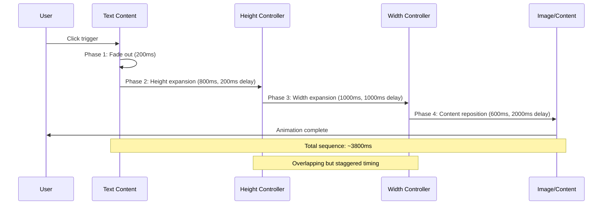
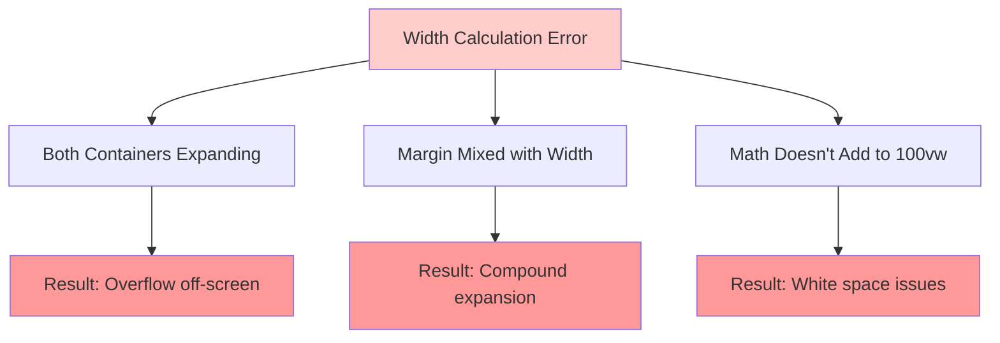
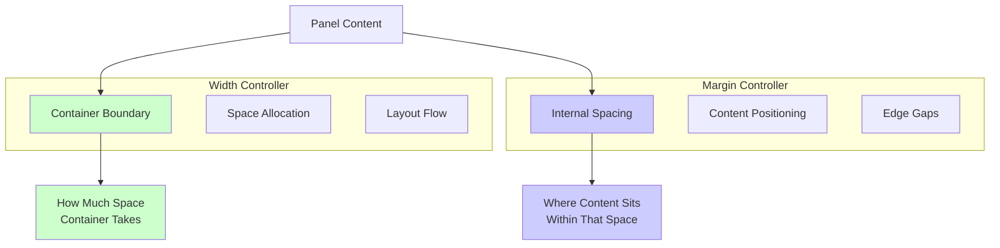
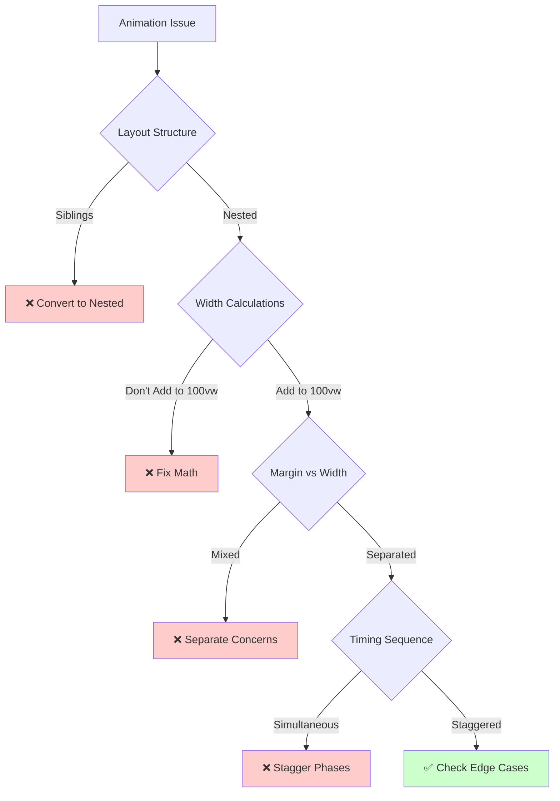

# 🎭 Animation Coding Guidance - Tailwind v4 Modal Systems

## 🚀 FUNDAMENTAL PRINCIPLES

### The Golden Rule: Separation of Concerns
**NEVER mix width calculations with margin calculations.** Each serves a distinct purpose:

- **Width**: Controls container boundary (how much space it takes up)
- **Margin**: Controls internal positioning (where content sits within that space)

### The Animation Hierarchy
Every modal animation must follow a **nested container structure** where each level controls ONE dimension:

1. **Portfolio Container** - Overall page layout
2. **Sidebar Container** - Fixed or shrinking text area
3. **Main Content Container** - WIDTH controller (expands)
4. **Adjusted Container** - HEIGHT controller (expands + repositions)
5. **Content Panel** - FILLER (takes available space)

## 📐 MODAL ANIMATION ARCHITECTURE

```mermaid
graph TD
    A[Portfolio Container] --> B[Text Sidebar]
    A --> C[Main Content Container]
    C --> D[Adjusted Container]
    D --> E[Content Panel]
    
    B --> F[Width: Shrinks<br/>calc(100vw-420px) → 420px]
    C --> G[Width: Fixed<br/>420px → 420px]
    D --> H[Height: Expands<br/>Margin: Changes<br/>Transform: Moves]
    E --> I[Content: Fills Available Space<br/>w-full h-full]
    
    style F fill:#ffcccc
    style G fill:#ccffcc  
    style H fill:#ccccff
    style I fill:#ffffcc
```

## ⚙️ ANIMATION SEQUENCE FLOW



## 🎯 WIDTH CALCULATION METHODOLOGY

### The Math Must Add Up
**CRITICAL**: Total widths must always equal 100vw (minus any page-level margins)

```mermaid
graph LR
    subgraph "Initial State"
        A1[Text Sidebar<br/>calc(100vw - 420px)] 
        B1[Right Panel<br/>420px]
    end
    
    subgraph "Expanded State"
        A2[Text Sidebar<br/>420px]
        B2[Right Panel<br/>calc(100vw - 420px)]
    end
    
    A1 --> A2
    B1 --> B2
    
    C1[Total: 100vw ✅] 
    C2[Total: 100vw ✅]
    
    A1 -.-> C1
    B1 -.-> C1
    A2 -.-> C2
    B2 -.-> C2
    
    style A1 fill:#ffcccc
    style A2 fill:#ccffcc
    style B1 fill:#ccffcc
    style B2 fill:#ffcccc
```

### ❌ Common Width Calculation Errors



## 🔧 SEPARATION OF CONCERNS

### Width vs Margin Responsibilities



### ❌ Broken Approach: Mixed Concerns
```tsx
// WRONG: Mixing margin into width calculation
width: 'calc(100vw - 420px - 40px)'  // ❌ Subtracting margin
margin: '20px 20px 20px 20px'         // ❌ Also changing margin
// Result: Double-counting space = expansion issues
```

### ✅ Correct Approach: Separated Concerns
```tsx
// CORRECT: Pure width calculation
width: 'calc(100vw - 420px)'          // ✅ Container boundary only
margin: '20px 20px 20px 20px'         // ✅ Internal spacing only
// Result: Clean, predictable behavior
```

## 🎪 ANIMATION TIMING COORDINATION

### Phase-Based Animation System

```mermaid
gantt
    title Modal Animation Sequence
    dateFormat X
    axisFormat %Lms
    
    section Text Transition
    Text Fade Out        :active, text1, 0, 200
    
    section Height Animation
    Height Expansion     :active, height1, 200, 1000
    
    section Width Animation  
    Width Expansion      :active, width1, 1000, 2000
    
    section Content Animation
    Image Repositioning  :active, content1, 2000, 2600
    
    section Overlays
    Total Duration       :milestone, total, 2600, 0
```



### Timing Rules
1. **Sequential phases** - each builds on the previous
2. **Overlapping transitions** - smooth visual flow  
3. **Staggered delays** - prevents visual jarring
4. **Reverse timing** - closing animations reverse the sequence

## 🎯 DEBUGGING DECISION TREE



## 📋 IMPLEMENTATION CHECKLIST

### Pre-Animation Setup
- [ ] ✅ Nested container structure (not siblings)
- [ ] ✅ Each container controls ONE dimension
- [ ] ✅ Width calculations add up to 100vw
- [ ] ✅ Margin and width calculations separated

### Animation Implementation
- [ ] ✅ Phase-based timing (text → height → width → content)
- [ ] ✅ Proper delays between phases
- [ ] ✅ Transition properties specified separately
- [ ] ✅ Reverse sequence for closing

### Testing & Validation
- [ ] ✅ No white space expansion
- [ ] ✅ Edges remain locked during animation
- [ ] ✅ Smooth visual transitions
- [ ] ✅ Math validates at each stage

## 🚀 SUCCESS PATTERNS

### The "Trading Space" Principle
Modal animations work by **trading space** between containers:
- One container **shrinks** to make room
- Another container **expands** to fill that space
- Total space allocation remains constant

### The "Single Responsibility" Principle  
Each container level has ONE job:
- Width controller: **only** manages horizontal space
- Height controller: **only** manages vertical space + positioning
- Content filler: **only** fills available space

### The "Sequential Cascade" Principle
Animations flow in logical order:
1. **Prepare** - fade out interfering content
2. **Expand vertically** - create height space
3. **Expand horizontally** - create width space  
4. **Reposition content** - final layout adjustments

**Remember**: These principles apply to ALL modal animations in the system. Master this methodology once, apply it everywhere.